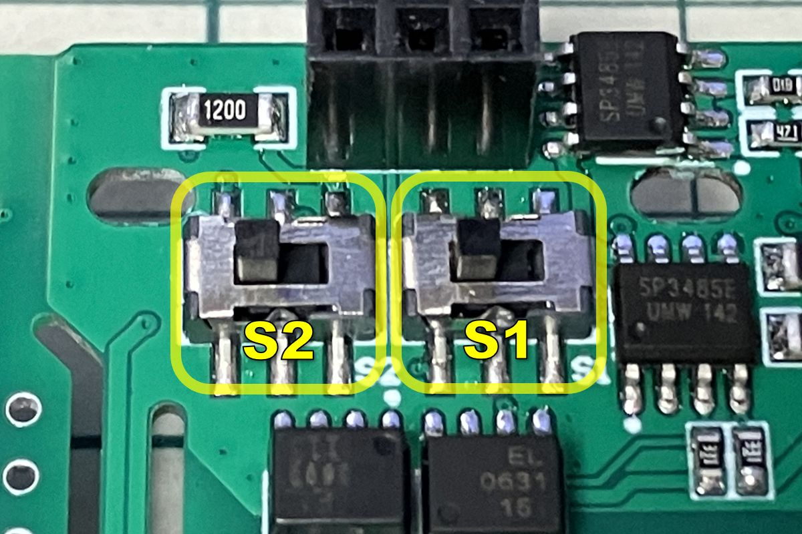
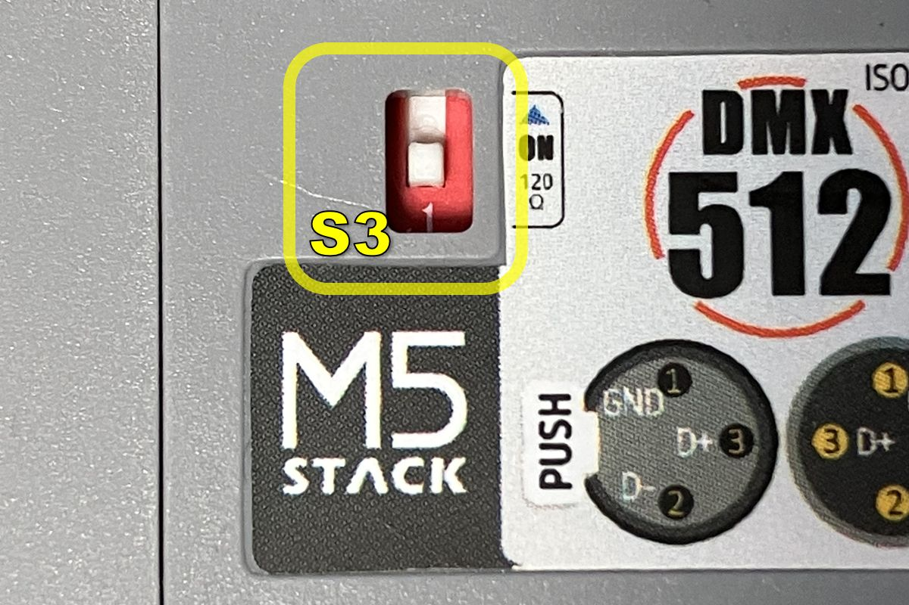
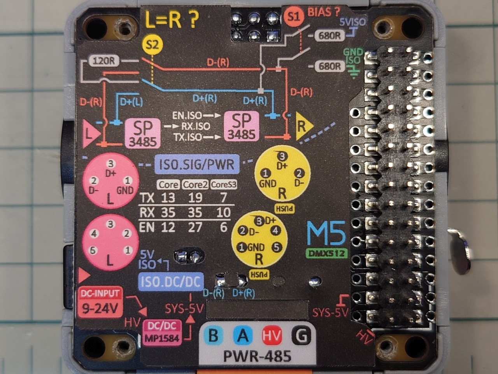

# Module DMX512 for M5Stack

### target devices
 - M5Stack BASIC / GRAY / GO / FIRE
 - M5Stack Core2
 - M5Stack CoreS3

---
### pin map

|       | Core1 | Core2 | CoreS3 |
| :---: | :---: | :---: | :----: |
|  TX   |  13   |  19   |   7    |
|  RX   |  35   |  35   |   10   |
|  EN   |  12   |  27   |   6    |

※ Core1 : BASIC / GRAY / GO / FIRE  
※ Core2 : Core2 / Core2AWS / TOUGH  

---
### Role of switches

 - S1 : BiasResistor ON (LEFT) / OFF (RIGHT) for OUT port
 - S2 : Pass-through (LEFT) or Separate(RIGHT)
 - S3 : TerminationResistor ON (UP) / OFF (DOWN) for IN port

#### S1 : BiasResistor for OUT port
 - OUTポートにバイアス抵抗を接続するスイッチです。
 - スイッチ位置が左 = バイアス抵抗が接続されます。
 - スイッチ位置が右 = バイアス抵抗なし。
 - IN側に機器を繋がない場合や、スイッチS2を分離(Separate)にした際、バイアス抵抗を接続すると通信が安定します。

#### S2 : Pass-through or Separate
 - IN-OUTポート間の配線を直結(Pass-through)するか、分離(Separate)するかを選択するスイッチです。
 - スイッチ位置が左 = INとOUTは直結され、IN側から入った信号はそのままOUT側に出力されます。
 - スイッチ位置が右 = INとOUTは分離され、別々の信号経路として動作します。

#### 直結(Pass-through)構成時の注意点
 - IN側から信号入力中にDMXモジュールからも信号出力すると、OUTポートの信号が混信して誤動作します。

#### 分離(Separate)構成時の注意点
 - INポートとOUTポートは別々の経路となるため、M5Stackのプログラムで信号を中継する必要があります。
 - RDM規格に対応した機器からの返信信号はOUTポートからINポートに中継されません。
 - RDM規格の返信信号を中継させたい場合は、直結(Pass-through)構成を選択してください。

#### S3 : TerminationResistor for IN port
 - INポートに終端抵抗を接続するスイッチです。
 - スイッチ位置が上 = 終端抵抗が接続されます。
 - スイッチ位置が下 = 終端抵抗なし。
 - OUT側に機器を繋がない場合や、スイッチS2で分離(Separate)構成にしたときにONにします。

### board image

### disassembly method

<video controls src="https://user-images.githubusercontent.com/42724151/234217553-ae37cacd-316a-4df9-acec-f7d605136cc1.mp4" muted="false"></video>

---
There is currently no official M5Stack library for the DMX512 module. 
We recommend using the [esp_dmx v2.0.2](https://github.com/someweisguy/esp_dmx/archive/refs/tags/v2.02.zip) library.

[someweisguy/esp_dmx](https://github.com/someweisguy/esp_dmx/tree/v2.02)

### sample application.
 - [DMX512Tools](examples/DMX512Tools/)

s